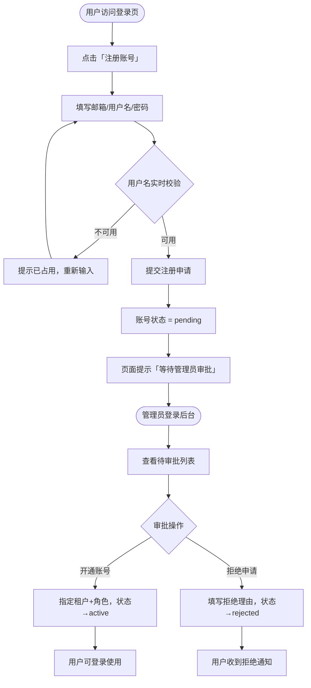
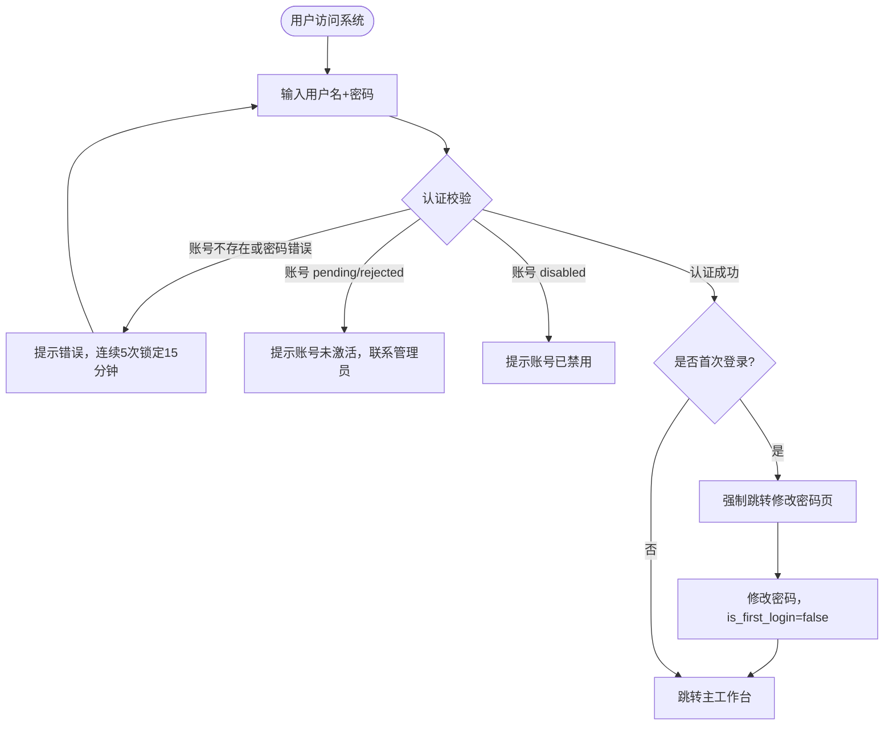
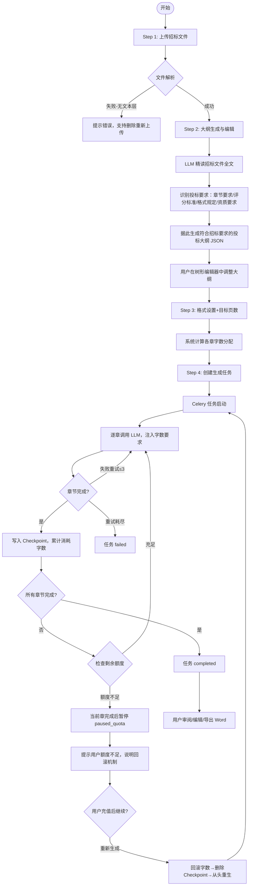
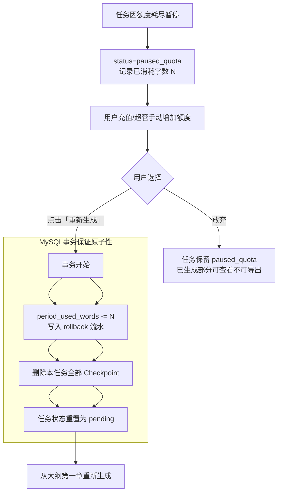
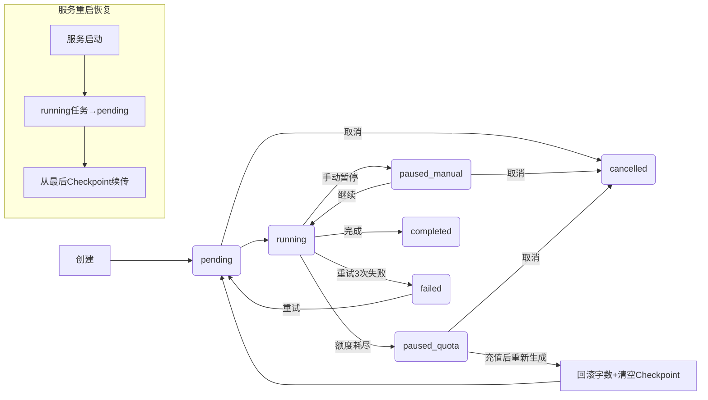
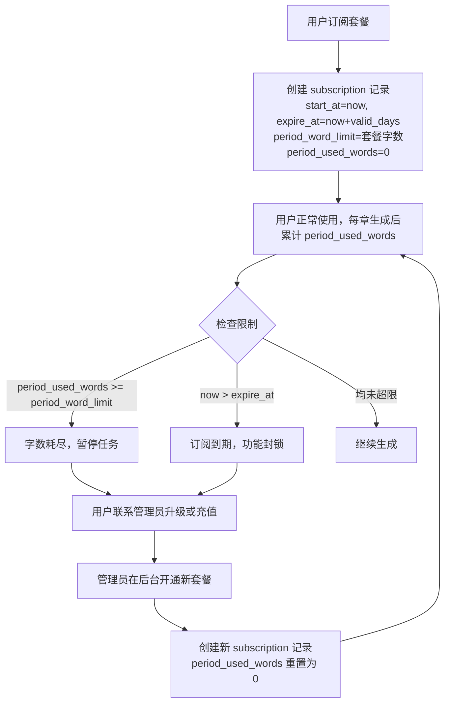
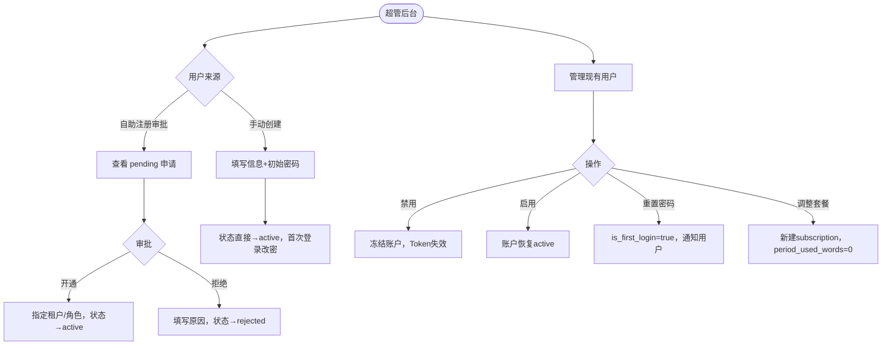

# 智能投标标书生成系统 · 产品需求文档

> **文档版本**：v2.2 &nbsp;|&nbsp; **更新日期**：2026年3月 &nbsp;|&nbsp; **文档状态**：草稿  
> **技术栈**：Next.js · FastAPI · MySQL · Redis · Celery

---

## 本版本变更说明（v2.1 → v2.2）

| # | 变更内容 |
|---|---------|
| 1 | LLM 配置功能收归超级管理员，移入管理后台；普通用户/租户管理员侧边栏删除「LLM设置」入口 |
| 2 | 新增管理后台三个页面原型：P13 租户管理、P14 LLM配置、P15 数据统计 |
| 3 | 计费模型调整：字数额度与订阅周期绑定，订阅到期续费时重置，**不再与自然月关联、月初不自动重置** |

---

## 目录

1. [产品概述](#1-产品概述)
2. [用户角色与权限](#2-用户角色与权限)
3. [业务流程总览](#3-业务流程总览)
4. [核心功能模块](#4-核心功能模块)
5. [UI 设计规范与页面原型](#5-ui-设计规范与页面原型)
6. [套餐与计费体系](#6-套餐与计费体系)
7. [多租户架构设计](#7-多租户架构设计)
8. [数据模型](#8-数据模型)
9. [API 接口规范](#9-api-接口规范)
10. [大模型配置模块](#10-大模型配置模块)
11. [非功能性需求](#11-非功能性需求)
12. [推荐技术架构](#12-推荐技术架构)
13. [版本迭代计划](#13-版本迭代计划)
14. [附录](#14-附录)

---

## 1. 产品概述

### 1.1 产品背景

政府采购、工程建设、IT 服务等领域招投标活动频繁，每份标书撰写耗时 3–10 天，需要大量专业人力。传统人工写标流程存在效率低下、质量不稳定、知识难以沉淀等痛点。

本系统基于大语言模型（LLM），实现从 **招标文件解析 → 大纲生成 → 正文撰写 → 格式输出** 的全流程自动化，帮助投标企业大幅提升标书质量与交付速度。

### 1.2 产品目标

- 将单份标书撰写周期从 3–10 天压缩至数小时内
- 支持多租户 SaaS 模式，面向外部用户对外运营
- 提供灵活的 LLM 配置，兼容主流国内外大模型
- 保证生成质量的同时支持人工介入修改

### 1.3 用户画像

| 用户类型 | 典型场景 | 核心诉求 |
|---------|---------|---------|
| 投标专员 | 每月处理 5–20 份标书，时间压力大 | 快速生成初稿，减少重复劳动 |
| 商务经理 | 监督多个投标项目并行推进 | 任务进度可视化，质量可控 |
| 企业管理员 | 管理公司内部多个使用账号 | 额度分配、用量统计、权限管控 |
| 平台超级管理员 | 运营 SaaS 平台，管理所有租户 | 用户管理、套餐配置、系统监控 |

---

## 2. 用户角色与权限

### 2.1 角色定义

| 角色 | 英文标识 | 说明 |
|-----|---------|-----|
| 超级管理员 | `super_admin` | 平台运营方，审批注册用户、管理所有租户，配置套餐、LLM 参数、查看全局数据统计 |
| 租户管理员 | `tenant_admin` | 企业/团队管理员，管理本租户内用户和额度 |
| 普通用户 | `user` | 最终使用者，创建和管理自己的标书项目 |

### 2.2 用户注册与账号开通流程

#### 2.2.1 第一阶段：用户自助注册 + 管理员审批开通

**注册信息（用户填写）：**

| 字段 | 规则 |
|-----|-----|
| 邮箱 | 合法邮箱格式，全局唯一 |
| 姓名 | 真实姓名，2–50 字符 |
| 用户名 | 全局唯一主键，3–30 位字母/数字/下划线，输入后实时异步校验 |
| 密码 | 8 位以上，含字母 + 数字 |

**用户名实时校验逻辑：**
- 输入停顿 500ms 后自动调用 `/auth/check-username`
- 可用：✅「用户名可用」；不可用：❌「用户名已被使用」；校验中：加载动画

**注册后状态：** 账号状态为 `pending`，无法登录，页面提示等待管理员审批开通。

**管理员后台审批：**
- 超管在「注册审批」中查看 `pending` 申请，执行开通（指定租户/角色）或拒绝（填写原因）

#### 2.2.2 第二阶段（规划）：邮箱验证码自动开通

#### 2.2.3 登录方式

- **第一阶段**：**用户名 + 密码**
- **第二阶段规划**：微信登录绑定

### 2.3 权限矩阵

| 功能模块 | 普通用户 | 租户管理员 | 超级管理员 |
|---------|:-------:|:--------:|:--------:|
| 上传/删除招标文件 | ✅ | ✅ | ✅ |
| 生成大纲/内容（扣字数） | ✅ | ✅ | ✅ |
| 查看自己的任务 | ✅ | ✅ | ✅ |
| 查看本租户所有任务 | ❌ | ✅ | ✅ |
| 管理本租户用户 | ❌ | ✅ | ✅ |
| 查看所有租户数据 | ❌ | ❌ | ✅ |
| 审批注册申请 | ❌ | ❌ | ✅ |
| 维护套餐配置 | ❌ | ❌ | ✅ |
| **LLM 配置**（全局/租户） | ❌ | ❌ | ✅ |
| 数据统计 | ❌ | ❌ | ✅ |

> **变更说明**：LLM 配置权限收归超级管理员，租户管理员不再单独配置 LLM，由超管统一维护。

---

## 3. 业务流程总览

### 3.1 用户注册与账号开通流程



### 3.2 用户登录与初始化流程



### 3.3 标书生成主流程



### 3.4 额度耗尽回滚与重新生成流程



### 3.5 任务状态机与断点续传



### 3.6 计费额度扣减与重置流程



### 3.7 超管用户管理流程



---

## 4. 核心功能模块

### 4.1 文件上传模块

> ⚠️ **不支持扫描件 OCR**：若文件无文本层，提示用户上传含文字的版本。

| 功能点 | 详细说明 |
|-------|---------|
| 支持格式 | PDF（.pdf）、Word（.docx / .doc），不支持扫描件 OCR |
| 文件大小 | 单文件最大 50MB |
| 上传方式 | 点击选择 或 拖拽上传，显示进度条 |
| 文本解析 | PDF 用 PyMuPDF；Word 用 python-docx；无文本层直接报错 |
| **删除文件** | 已上传文件可点击「删除」移除，需二次确认；大纲已生成时同步清空大纲，回到 Step 1 |
| 存储策略 | 原始文件存储至 OSS；删除为软删除，OSS 文件保留 30 天 |
| 安全校验 | MIME + 文件头魔数白名单校验，拒绝可执行文件 |

### 4.2 大纲生成与编辑模块

**LLM 大纲生成要求：**

```
System Prompt 核心指令：
你是资深投标文件撰写专家。请精读招标文件全文，重点识别：
1. 招标文件对投标文件的章节要求（"投标文件须包含..."）
2. 评分标准中的各评分项（每项对应独立章节）
3. 格式规定（页数限制、必须包含的内容）
4. 资质和业绩要求章节

基于以上分析，生成完整投标大纲：
- 大纲必须完整响应招标文件的所有要求，不遗漏强制响应项
- 返回 JSON：[{"level":1,"title":"...","children":[...]}]
```

**超长文件处理：** 文本 > 模型上下文限制时，先提取目录、评分标准、技术要求章节组合输入；推荐使用 moonshot-v1-128k / qwen-long 等长上下文模型。

**编辑器功能：** 树形所见即所得，支持节点增删改/拖拽排序/展开折叠；每节点显示分配字数；自动保存最后编辑状态。

### 4.3 格式设置模块

- 用户输入目标页数（整数 1–999），系统计算：总字数 = 目标页数 × 每页基准字数（默认 700，超管可配置）
- 总字数按章节均匀分配，用户可微调各章字数配额
- LLM 每章 Prompt 注入字数要求：`请为「{title}」撰写 {X} 字左右，允许±10%误差`

**预置格式模板：**

| 模板 | 一级标题 | 二级标题 | 正文 | 场景 |
|-----|---------|---------|-----|-----|
| 政府标准 | 黑体 16pt 居中 | 黑体 14pt 左对齐 | 宋体 12pt 1.5倍 | 政府采购 |
| 商务简洁 | Arial 18pt 加粗 | Arial 14pt 加粗 | Arial 11pt 1.2倍 | IT 服务 |
| 工程规范 | 黑体 16pt 加粗 | 黑体 13pt 加粗 | 仿宋 12pt 双倍 | 工程建设 |

### 4.4 内容生成模块

**额度耗尽处理策略：**

| 场景 | 系统行为 |
|-----|---------|
| 任务开始前额度不足 | 禁止创建任务，提示联系管理员 |
| 任务运行中额度耗尽 | 当前章完成后暂停，`status=paused_quota` |
| 用户充值后选择重新生成 | **事务回滚字数 → 清空 Checkpoint → 从第一章重新生成** |
| 用户不充值 | 保留 `paused_quota`，已生成部分可查看不可导出 |

> **回滚原子性保证**：回滚操作在 MySQL 事务中执行，`period_used_words -= N`、写流水记录、清空 Checkpoint 三步原子完成，任一失败则全部回滚。

### 4.5 文档导出

- 仅支持 Word（.docx），任务状态必须为 `completed`
- 命名格式：`[项目名]-[日期].docx`

### 4.6 任务管理

**状态机：**

| 状态 | 说明 | 可执行操作 |
|-----|-----|---------|
| `pending` | 等待执行 | 取消 |
| `running` | 生成中 | 暂停、查看进度 |
| `paused_manual` | 手动暂停 | 继续、取消 |
| `paused_quota` | 额度耗尽暂停 | 充值后重新生成、取消 |
| `completed` | 完成 | 下载、编辑 |
| `failed` | 失败 | 重试、查看日志 |
| `cancelled` | 取消（终态） | — |

---

## 5. UI 设计规范与页面原型

### 5.1 视觉设计系统

#### 双主题 Token

##### 🌞 白天模式（Light Mode）

| Token | 值 | 用途 |
|------|----|-----|
| `--color-bg-base` | `#F0F5FF` | 页面背景 |
| `--color-bg-surface` | `#FFFFFF` | 卡片/面板 |
| `--color-bg-sidebar` | `#1A2744` | 侧边栏 |
| `--color-primary` | `#0057FF` | 主按钮、高亮 |
| `--color-primary-hover` | `#0040CC` | 主按钮 hover |
| `--color-accent` | `#00C2FF` | 科技点缀、进度条 |
| `--color-success` | `#00C896` | 成功 |
| `--color-warning` | `#FF9500` | 警告 |
| `--color-danger` | `#FF3B5C` | 错误/危险 |
| `--color-text-primary` | `#0D1B3E` | 主文字 |
| `--color-text-secondary` | `#4A6087` | 次级文字 |
| `--color-border` | `#C8D8F0` | 边框 |

##### 🌙 深夜模式（Dark Mode）

| Token | 值 | 用途 |
|------|----|-----|
| `--color-bg-base` | `#080E1C` | 页面背景（深空黑） |
| `--color-bg-surface` | `#0F1829` | 卡片/面板 |
| `--color-bg-sidebar` | `#060C18` | 侧边栏 |
| `--color-primary` | `#00C2FF` | 主按钮（亮青色） |
| `--color-primary-hover` | `#33D0FF` | 主按钮 hover |
| `--color-accent` | `#7B5CFF` | 科技点缀（紫色） |
| `--color-success` | `#00E5A0` | 成功 |
| `--color-warning` | `#FFB340` | 警告 |
| `--color-danger` | `#FF5C7A` | 错误 |
| `--color-text-primary` | `#E8F0FF` | 主文字 |
| `--color-text-secondary` | `#7A96C2` | 次级文字 |
| `--color-border` | `#1E2F50` | 边框 |

#### 按钮规范

| 类型 | Light | Dark | 对比度 |
|-----|-------|------|-------|
| Primary | bg:`#0057FF` text:`#FFF` | bg:`#00C2FF` text:`#080E1C` | ≥4.5:1 ✅ |
| Secondary | bg:`#EEF3FF` text:`#0057FF` | bg:`#0F2040` text:`#00C2FF` | ≥4.5:1 ✅ |
| Danger | bg:`#FF3B5C` text:`#FFF` | bg:`#FF5C7A` text:`#080E1C` | ≥4.5:1 ✅ |
| Ghost | bg:transparent text:`#4A6087` | bg:transparent text:`#7A96C2` | ≥3:1 ✅ |

#### 响应式断点

| 断点 | 尺寸 | 策略 |
|-----|-----|-----|
| Desktop | ≥1280px | 左侧固定侧边栏（240px）+ 主内容区 |
| Tablet | 768–1279px | 侧边栏折叠为图标模式（60px） |
| Mobile | <768px | 顶部导航 + 底部 Tab |

#### 全局页面框架（所有登录后页面统一）

```
┌─────────────────────────────────────────────────────────────────┐
│  顶部导航（56px）                                                  │
│  ⬡ BidAI · [页面标题]                     ☀️/🌙  🔔  [用户名▼]  │
├────────────┬────────────────────────────────────────────────────┤
│            │                                                     │
│  左侧菜单  │                                                     │
│  (240px)  │              主内容区                                │
│            │                                                     │
│  ── 用户端 │                                                     │
│  📁 我的项目│                                                     │
│  ✅ 任务列表│                                                     │
│  👤 账户   │                                                     │
│  ──────   │                                                     │
│  套餐状态  │                                                     │
│  [剩余字数]│                                                     │
│  [到期时间]│                                                     │
│  ████░░   │                                                     │
│            │                                                     │
└────────────┴────────────────────────────────────────────────────┘

侧边栏 Light: bg=#1A2744  当前菜单项: accent色左边框+背景高亮
侧边栏 Dark:  bg=#060C18  字色: #7A96C2，当前项高亮
```

---

### 5.2 用户端页面原型

#### P01 · 登录页（/login）

```
┌─────────────────────────────────────────────────────────────────┐
│ ████████████████████████████████████  ← 顶部渐变装饰条           │
│                                                                  │
│           ⬡  BidAI  智能投标标书生成系统              ☀️/🌙      │
│                                                                  │
│      ┌──────────────────────────────────────────────┐           │
│      │  欢迎回来                                     │           │
│      │  请使用您的账号登录                            │           │
│      │                                              │           │
│      │  用户名                                       │           │
│      │  ┌──────────────────────────────────────┐   │           │
│      │  │ 👤  请输入用户名                       │   │           │
│      │  └──────────────────────────────────────┘   │           │
│      │                                              │           │
│      │  密码                                        │           │
│      │  ┌──────────────────────────────────────┐   │           │
│      │  │ 🔒  请输入密码                   👁   │   │           │
│      │  └──────────────────────────────────────┘   │           │
│      │                                              │           │
│      │  ┌──────────────────────────────────────┐   │           │
│      │  │           立即登录  →                 │   │           │  ← Primary
│      │  └──────────────────────────────────────┘   │           │
│      │                                              │           │
│      │  还没有账号？  [点击注册]                      │           │
│      │  忘记密码？请联系管理员重置                    │           │
│      └──────────────────────────────────────────────┘           │
│ ░░░░░░░░░░░░░░░░░░░░░░░░░░░░░░░  ← 科技网格背景                 │
│                   © 2026 BidAI · v1.2                          │
└─────────────────────────────────────────────────────────────────┘
```

---

#### P01-B · 用户注册页（/register）

```
┌─────────────────────────────────────────────────────────────────┐
│ ████████████████████████████████████                  ☀️/🌙     │
│           ⬡  BidAI  智能投标标书生成系统                          │
│                                                                  │
│      ┌──────────────────────────────────────────────┐           │
│      │  创建新账号                                    │           │
│      │  注册后需等待管理员审批，审批后方可登录           │           │
│      │                                              │           │
│      │  邮箱地址  *                                  │           │
│      │  ┌──────────────────────────────────────┐   │           │
│      │  │ ✉  请输入邮箱地址                      │   │           │
│      │  └──────────────────────────────────────┘   │           │
│      │                                              │           │
│      │  真实姓名  *                                  │           │
│      │  ┌──────────────────────────────────────┐   │           │
│      │  │ 👤  请输入真实姓名                     │   │           │
│      │  └──────────────────────────────────────┘   │           │
│      │                                              │           │
│      │  用户名  *  （登录时使用，注册后不可修改）       │           │
│      │  ┌──────────────────────────────────────┐   │           │
│      │  │ @  请输入用户名（字母/数字/下划线）    │   │           │
│      │  └──────────────────────────────────────┘   │           │
│      │  ✅ 用户名「john_doe」可用                    │           │  ← 实时校验
│      │                                              │           │
│      │  登录密码  *  ≥8位，含字母+数字               │           │
│      │  ┌──────────────────────────────────────┐   │           │
│      │  │ 🔒                              👁   │   │           │
│      │  └──────────────────────────────────────┘   │           │
│      │  ██████████░░░  强度：中                      │           │
│      │                                              │           │
│      │  ┌──────────────────────────────────────┐   │           │
│      │  │        提交注册申请  →               │   │           │  ← Primary
│      │  └──────────────────────────────────────┘   │           │
│      │  已有账号？  [返回登录]                        │           │
│      └──────────────────────────────────────────────┘           │
└─────────────────────────────────────────────────────────────────┘

提交成功后：
┌──────────────────────────────────────────┐
│  🎉  注册申请已提交！                      │
│  账号待管理员审批，审批通过后可登录。        │
│              [返回登录页]                  │
└──────────────────────────────────────────┘
```

---

#### P02 · 首次登录修改密码（/change-password）

```
┌─────────────────────────────────────────────────────────────────┐
│  ⬡ BidAI                                              ☀️/🌙    │
├─────────────────────────────────────────────────────────────────┤
│      ┌──────────────────────────────────────────────┐           │
│      │  🔐  安全提醒 — 请立即修改初始密码              │           │
│      │                                              │           │
│      │  当前密码（初始密码）                          │           │
│      │  ┌──────────────────────────────────────┐   │           │
│      │  │ ••••••••                        👁   │   │           │
│      │  └──────────────────────────────────────┘   │           │
│      │  新密码   ≥8位，含字母+数字                    │           │
│      │  ┌──────────────────────────────────────┐   │           │
│      │  │                                 👁   │   │           │
│      │  └──────────────────────────────────────┘   │           │
│      │  ████████████░░░  强度：中                    │           │
│      │  确认新密码                                   │           │
│      │  ┌──────────────────────────────────────┐   │           │
│      │  │                                 👁   │   │           │
│      │  └──────────────────────────────────────┘   │           │
│      │  ┌──────────────────────────────────────┐   │           │
│      │  │       确认修改，进入系统  →            │   │           │
│      │  └──────────────────────────────────────┘   │           │
│      └──────────────────────────────────────────────┘           │
└─────────────────────────────────────────────────────────────────┘
```

---

#### P03 · 主工作台（/dashboard）

```
┌─────────────────────────────────────────────────────────────────┐
│  ⬡ BidAI · 工作台                           ☀️/🌙  🔔  [张三▼] │
├────────────┬────────────────────────────────────────────────────┤
│            │                                                     │
│  📁 我的项目│  概览                                               │
│  ✅ 任务列表│  ┌──────────┐  ┌──────────┐  ┌──────────┐         │
│  👤 账户   │  │ 本期用量  │  │ 进行中   │  │ 已完成   │         │
│  ──────   │  │          │  │          │  │          │         │
│  套餐状态  │  │  32万字   │  │  3 任务  │  │ 12 项目  │         │
│  基础版    │  │  /50万    │  │          │  │          │         │
│  剩余18万  │  │ ████████░ │  │  [查看]  │  │  [查看]  │         │
│  到期:4/15 │  └──────────┘  └──────────┘  └──────────┘         │
│  ████████░ │                                                     │
│            │  我的项目                           [+ 新建项目]    │
│  [联系管理 │  ┌──────────────────────────────────────────────┐  │
│   员升级]  │  │ 标书名称           状态    更新时间    操作    │  │
│            │  ├──────────────────────────────────────────────┤  │
│            │  │ XX市政道路工程      ✅完成  03-09  [编辑][↓]  │  │
│            │  │ XX软件开发服务      ⚙️生成  03-10  [查看]     │  │
│            │  │ XX安全运维服务      📋待生成 03-10  [继续]    │  │
│            │  │ XX数据中心建设      ❌失败  03-08  [重试]     │  │
│            │  └──────────────────────────────────────────────┘  │
└────────────┴────────────────────────────────────────────────────┘

注：侧边栏无「LLM设置」入口，LLM 配置仅限超管后台操作
套餐用量显示：「本期已用 / 本期限额」，不显示「本月」字样
```

---

#### P04 · Step 1 上传招标文件（/projects/new/upload）

```
┌─────────────────────────────────────────────────────────────────┐
│  ⬡ BidAI · 新建项目                         ☀️/🌙  🔔  [张三▼] │
├────────────┬────────────────────────────────────────────────────┤
│            │                                                     │
│  📁 我的项目│  ①上传文件 ──── ②确认大纲 ──── ③格式设置 ──── ④生成 │
│  ✅ 任务列表│                                                     │
│  👤 账户   │  ┌──────────────────────────────────────────────┐  │
│  ──────   │  │                 📄                            │  │
│  套餐状态  │  │                                              │  │
│  剩余18万  │  │      拖拽招标文件至此处，或                    │  │
│  到期:4/15 │  │             [选择文件]                        │  │
│  ████████░ │  │                                              │  │
│            │  │  支持 PDF、Word（.docx/.doc）  最大 50MB      │  │
│  [联系管理 │  │  ⚠️ 不支持扫描件，需含文字层                   │  │
│   员升级]  │  └──────────────────────────────────────────────┘  │
│            │                                                     │
│            │  ── 已上传文件 ─────────────────────────────────    │
│            │  📄 XX采购招标文件.pdf   24,831字   03-10 14:21     │
│            │                                     [删除文件 🗑]   │
│            │  ✅ 解析完成，已提取 24,831 字                        │
│            │                      [下一步：生成大纲 →]            │
└────────────┴────────────────────────────────────────────────────┘

删除弹窗（大纲已生成时）：
┌──────────────────────────────────────────┐
│  ⚠️  确认删除文件？                        │
│  删除将同时清空已生成的大纲，需重新操作。    │
│         [取消]      [确认删除]             │
└──────────────────────────────────────────┘
```

---

#### P05 · Step 2 大纲编辑（/projects/{id}/outline）

```
┌─────────────────────────────────────────────────────────────────┐
│  ⬡ BidAI · 确认大纲                         ☀️/🌙  🔔  [张三▼] │
├────────────┬────────────────────────────────────────────────────┤
│            │                                                     │
│  📁 我的项目│  ①上传文件 ✓ ── ②确认大纲 ── ③格式设置 ── ④生成    │
│  ✅ 任务列表│                                                     │
│  👤 账户   │  ℹ️ AI 已根据招标文件的投标要求与评分标准生成大纲，     │
│  ──────   │     请核对并按需调整。                                │
│  套餐状态  │                                                     │
│  剩余18万  │  ┌──────────────────────────────────────────────┐  │
│  到期:4/15 │  │  ▼ 第一章  技术方案                  ✏️ ＋ 🗑 │  │
│  ████████░ │  │    ▼ 1.1  项目理解与分析              ✏️ ＋ 🗑 │  │
│            │  │      › 1.1.1 招标需求解读             ✏️ ＋ 🗑 │  │
│  [联系管理 │  │      › 1.1.2 项目难点分析             ✏️ ＋ 🗑 │  │
│   员升级]  │  │    ▼ 1.2  总体技术思路               ✏️ ＋ 🗑 │  │
│            │  │  ▼ 第二章  项目管理方案               ✏️ ＋ 🗑 │  │
│            │  │    › 2.1  项目组织架构                ✏️ ＋ 🗑 │  │
│            │  │    › 2.2  进度计划安排                ✏️ ＋ 🗑 │  │
│            │  │  ▼ 第三章  质量保障体系               ✏️ ＋ 🗑 │  │
│            │  │                       [＋ 添加一级章节]│  │
│            │  └──────────────────────────────────────────────┘  │
│            │  共 3 章，12 节                                      │
│            │  [AI 重新生成]  [← 返回]   [确认大纲，下一步 →]      │
└────────────┴────────────────────────────────────────────────────┘
```

---

#### P06 · Step 3 格式与页数设置（/projects/{id}/format）

```
┌─────────────────────────────────────────────────────────────────┐
│  ⬡ BidAI · 格式设置                         ☀️/🌙  🔔  [张三▼] │
├────────────┬────────────────────────────────────────────────────┤
│            │                                                     │
│  📁 我的项目│  ①上传 ✓ ── ②大纲 ✓ ── ③格式设置 ── ④生成          │
│  ✅ 任务列表│                                                     │
│  👤 账户   │  ┌─────────────────────┐  ┌──────────────────────┐ │
│  ──────   │  │ 格式模板              │  │ 字数规划             │ │
│  套餐状态  │  │ ○ 政府标准            │  │ 目标页数  [60]   页   │ │
│  剩余18万  │  │ ● 商务简洁            │  │ 每页字数  [700]  字   │ │
│  ████████░ │  │ ○ 工程规范            │  │ ─────────────────── │ │
│            │  │ ○ 自定义              │  │ 总字数    42,000 字  │ │
│  [联系管理 │  │                      │  │ 第一章 ████░  12,600 │ │
│   员升级]  │  │ 一级标题              │  │ 第二章 ████░  10,500 │ │
│            │  │ 字体[黑体▼] 号[16▼]  │  │ 第三章 ████░   8,400 │ │
│            │  │ 对齐[居中▼]          │  │ [点击调整各章分配]   │ │
│            │  │                      │  │ ⚠️ 总分配需=总字数   │ │
│            │  │ 正文                  │  └──────────────────────┘ │
│            │  │ 字体[仿宋▼] 号[12▼]  │                           │
│            │  │ 行距[1.5倍▼]         │                           │
│            │  │ 页面 A4  边距 2.5cm  │                           │
│            │  └─────────────────────┘                           │
│            │  [← 返回大纲]                  [开始生成文档 →]      │
└────────────┴────────────────────────────────────────────────────┘
```

---

#### P07 · Step 4 生成进度（/projects/{id}/generate）

```
┌─────────────────────────────────────────────────────────────────┐
│  ⬡ BidAI · 文档生成                         ☀️/🌙  🔔  [张三▼] │
├────────────┬────────────────────────────────────────────────────┤
│            │                                                     │
│  📁 我的项目│  ①上传 ✓ ── ②大纲 ✓ ── ③格式 ✓ ── ④生成中...     │
│  ✅ 任务列表│                                                     │
│  👤 账户   │  ┌──────────────────────────────────────────────┐  │
│  ──────   │  │ 总进度   [██████████████░░░░░░] 58%           │  │
│  套餐状态  │  │ 7 / 12 章节 · 预计剩余 4 分钟                  │  │
│  ⚠️ 剩余不足│  │                                              │  │
│  本期余额  │  │ ✅ 第一章  技术方案                  3,241字  │  │
│  不足10%  │  │ ✅ 1.1   项目理解与分析               856字   │  │
│            │  │ ✅ 第二章  项目管理方案               2,108字  │  │
│  [联系管理 │  │ ⚙️  第三章  质量保障                生成中... │  │
│   员升级]  │  │ ○  3.1   质量管理制度                        │  │
│            │  │ ○  第四章  商务方案                          │  │
│            │  └──────────────────────────────────────────────┘  │
│            │  已生成 24,863字 / 目标 42,000字                    │
│            │                [⬜ 取消]     [⏸ 后台执行]           │
└────────────┴────────────────────────────────────────────────────┘

额度耗尽暂停时底部替换为：
┌──────────────────────────────────────────────────────────────┐
│  ⚠️  本期字数额度已耗尽，任务已暂停（已生成 7/12 章节）          │
│  充值后继续时，系统将：                                        │
│  ① 退还本次任务已消耗的 24,863 字至您的额度                    │
│  ② 依据您确认的大纲，从第一章重新完整生成                       │
│  [取消任务]       [联系管理员增加额度，完成后重新生成]            │
└──────────────────────────────────────────────────────────────┘
```

---

#### P08 · 文档编辑器（/projects/{id}/editor）

```
┌─────────────────────────────────────────────────────────────────┐
│  ⬡ BidAI · XX市政工程投标书                 ☀️/🌙  🔔  [张三▼] │
├────────────┬──────────────────────────────────┬────────────────┤
│            │  [B][I][U][H1][H2] ─── [↩ 撤销]  │                │
│  📁 我的项目│  ──────────────────────────────  │  字数统计      │
│  ✅ 任务列表│                                  │  当前章  856字  │
│  👤 账户   │  1.1 项目理解与分析               │  目标   900字  │
│  ──────   │                                  │  ██████░░      │
│  章节目录  │  本项目位于XX市核心区域，根据招      │                │
│  ▼ 第一章  │  标文件要求，我方对项目背景及核心     │  全文 24,863字 │
│    ▼ 1.1  │  诉求进行了深入分析...              │  目标 42,000字 │
│      1.1.1│                                  │  ██████░░      │
│    ▼ 1.2  │                                  │                │
│  ▼ 第二章  │                                  │ [重新生成      │
│    2.1    │                                  │  当前章节]     │
│  ──────   │                                  │ ──────────     │
│  ✅ 自动保存│                                  │ [导出 Word]    │
└────────────┴──────────────────────────────────┴────────────────┘
```

---

#### P09 · 任务列表（/tasks）

```
┌─────────────────────────────────────────────────────────────────┐
│  ⬡ BidAI · 任务列表                         ☀️/🌙  🔔  [张三▼] │
├────────────┬────────────────────────────────────────────────────┤
│            │                                                     │
│  📁 我的项目│  生成任务列表                                        │
│  ✅ 任务列表│  [全部]  [进行中]  [已完成]  [失败]                   │
│  👤 账户   │                                                     │
│  ──────   │  ┌──────────────────────────────────────────────┐  │
│  套餐状态  │  │ 项目名称       状态      进度    时间     操作 │  │
│  剩余18万  │  ├──────────────────────────────────────────────┤  │
│  到期:4/15 │  │ XX市政工程     ⚙️生成中   7/12  03-10 14:21  │  │
│  ████████░ │  │                ████████░░░  58%              │  │
│            │  │                          [暂停]  [取消]      │  │
│  [联系管理 │  ├──────────────────────────────────────────────┤  │
│   员升级]  │  │ XX软件服务     ✅完成      12/12 03-09 09:15  │  │
│            │  │                                [编辑] [下载] │  │
│            │  ├──────────────────────────────────────────────┤  │
│            │  │ XX安全运维     ⚠️额度耗尽   5/10 03-08 16:40  │  │
│            │  │                已消耗字数将在重新生成时退还     │  │
│            │  │                        [重新生成]  [取消]    │  │
│            │  ├──────────────────────────────────────────────┤  │
│            │  │ XX数据中心     ❌失败       3/8  03-07 11:30  │  │
│            │  │                LLM 调用超时                   │  │
│            │  │                       [重试]  [查看日志]     │  │
│            │  └──────────────────────────────────────────────┘  │
└────────────┴────────────────────────────────────────────────────┘
```

---

#### P10 · 账户中心（/account）

```
┌─────────────────────────────────────────────────────────────────┐
│  ⬡ BidAI · 账户中心                         ☀️/🌙  🔔  [张三▼] │
├────────────┬────────────────────────────────────────────────────┤
│            │                                                     │
│  📁 我的项目│  账户中心                                           │
│  ✅ 任务列表│  ┌──────────────────────┐  ┌──────────────────────┐│
│  👤 账户   │  │ 基本信息              │  │ 套餐与用量            ││
│  ──────   │  │ 姓名   张三           │  │ 当前套餐  基础版       ││
│  套餐状态  │  │ 用户名 zhangsan       │  │ 订阅时间  2026-03-01  ││
│  剩余18万  │  │ 邮箱   z@abc.com     │  │ 到期时间  2026-04-15  ││
│  ████████░ │  │ 角色   普通用户       │  │                      ││
│            │  │ 租户   XX科技        │  │ 本期字数              ││
│  [联系管理 │  │                      │  │ 32万 / 50万           ││
│   员升级]  │  │ [修改密码]           │  │ ████████████░░  64%  ││
│            │  └──────────────────────┘  │ ⚠️ 字数不足请联系管理 ││
│            │                            └──────────────────────┘│
│            │  ┌──────────────────────────────────────────────┐  │
│            │  │ 外观设置                                      │  │
│            │  │  界面主题   ☀️ 白天模式  |  🌙 深夜模式        │  │
│            │  └──────────────────────────────────────────────┘  │
│            │  ┌──────────────────────────────────────────────┐  │
│            │  │ 套餐开通记录                                  │  │
│            │  │ 时间          套餐   字数限额    到期时间      │  │
│            │  │ 2026-03-01   基础版  50万字   2026-04-15 ✅   │  │
│            │  │ 2026-01-15   基础版  50万字   2026-02-28 ✅   │  │
│            │  └──────────────────────────────────────────────┘  │
└────────────┴────────────────────────────────────────────────────┘
```

---

### 5.3 管理后台页面原型

管理后台采用独立布局，左侧菜单包含：👥 用户管理 /  🏢 租户管理 / 📦 套餐管理 / 🤖 LLM 配置 / 📊 数据统计。

#### P11 · 管理后台 - 用户管理（/admin/users）

```
┌─────────────────────────────────────────────────────────────────┐
│  ⬡ BidAI · 管理后台                         ☀️/🌙  [超管 ▼]   │
├───────────────┬─────────────────────────────────────────────────┤
│               │                                                  │
│  👥 用户管理  │  用户管理                       [+ 手动新建用户]  │
│  🏢 租户管理  │  [全部] [待审批 (3)] [正常] [禁用]                │
│  📦 套餐管理  │  搜索:[_________]  租户:[全部▼]  角色:[全部▼]    │
│  🤖 LLM配置  │                                                  │
│  📊 数据统计  │  ┌────────────────────────────────────────────┐ │
│               │  │姓名  用户名    邮箱      角色  租户  状态 操作│ │
│               │  ├────────────────────────────────────────────┤ │
│               │  │张三  zhangsan  z@a.com  用户  XX科  ✅ [···]│ │
│               │  │李明  liming    l@b.com  管理员 YY公  ✅ [···]│ │
│               │  │王华  wanghua   w@c.com  用户  ─     ⏳待审批│ │
│               │  │              [开通账号]  [拒绝申请]          │ │
│               │  └────────────────────────────────────────────┘ │
│               │                                                  │
└───────────────┴─────────────────────────────────────────────────┘
```

---

#### P12 · 管理后台 - 套餐管理（/admin/plans）

```
┌─────────────────────────────────────────────────────────────────┐
│  ⬡ BidAI · 管理后台                         ☀️/🌙  [超管 ▼]   │
├───────────────┬─────────────────────────────────────────────────┤
│               │                                                  │
│  👥 用户管理  │  套餐管理                            [+ 新建套餐] │
│  🏢 租户管理  │  ┌──────────────────────────────────────────┐   │
│  📦 套餐管理  │  │套餐名  月费   字数/期    有效天数  状态  操作│   │
│  🤖 LLM配置  │  ├──────────────────────────────────────────┤   │
│  📊 数据统计  │  │基础版  199元  50万字/期  30天   ✅上架 [编辑]│   │
│               │  │专业版  599元  200万字/期 30天   ✅上架 [编辑]│   │
│               │  │企业版 1999元 1000万字/期 30天   ✅上架 [编辑]│   │
│               │  └──────────────────────────────────────────┘   │
│               │  全局参数                                         │
│               │  每页基准字数: [700] 字/页           [保存]       │
└───────────────┴─────────────────────────────────────────────────┘
```

---

#### P13 · 管理后台 - 租户管理（/admin/tenants）

```
┌─────────────────────────────────────────────────────────────────┐
│  ⬡ BidAI · 管理后台                         ☀️/🌙  [超管 ▼]   │
├───────────────┬─────────────────────────────────────────────────┤
│               │                                                  │
│  👥 用户管理  │  租户管理                            [+ 新建租户] │
│  🏢 租户管理  │  搜索: [_______________]                          │
│  📦 套餐管理  │                                                  │
│  🤖 LLM配置  │  ┌──────────────────────────────────────────────┐│
│  📊 数据统计  │  │租户名称   用户数  当前套餐  到期时间  字数用量  操作│
│               │  ├──────────────────────────────────────────────┤│
│               │  │XX科技有限公司  5人  基础版  2026-04-15         ││
│               │  │              本期 32万/50万  ████████░  64%   ││
│               │  │                               [详情] [管理套餐]││
│               │  ├──────────────────────────────────────────────┤│
│               │  │YY信息技术    12人  专业版  2026-05-01          ││
│               │  │              本期 180万/200万 ██████████ 90%  ││
│               │  │              ⚠️ 字数剩余不足10%  [详情] [管理套餐]│
│               │  ├──────────────────────────────────────────────┤│
│               │  │ZZ工程建设     3人  基础版  2026-03-20 ⚠️即将到期│
│               │  │              本期 10万/50万   ████░░░░  20%   ││
│               │  │                               [详情] [管理套餐]││
│               │  └──────────────────────────────────────────────┘│
└───────────────┴─────────────────────────────────────────────────┘

[详情] 弹窗：
┌────────────────────────────────────────────────────┐
│  租户详情：XX科技有限公司                          ✕ │
├────────────────────────────────────────────────────┤
│  基本信息                                           │
│  租户ID：1001   创建时间：2025-12-01                │
│                                                    │
│  当前套餐：基础版  (199元/期)                        │
│  订阅时间：2026-03-01   到期时间：2026-04-15         │
│  本期字数：已用 32万 / 限额 50万                    │
│  字数余额：18万字                                    │
│                                                    │
│  成员列表（5人）                                    │
│  ┌────────────────────────────────────────────┐   │
│  │ 姓名   用户名     角色      状态             │   │
│  │ 张三   zhangsan  管理员    ✅                │   │
│  │ 李四   lisi      普通用户  ✅                │   │
│  │ 王五   wangwu    普通用户  🚫禁用            │   │
│  └────────────────────────────────────────────┘   │
│                                                    │
│  [手动开通/续期套餐]         [禁用该租户]           │
└────────────────────────────────────────────────────┘

[管理套餐] 弹窗：
┌────────────────────────────────────────────────────┐
│  为「XX科技有限公司」开通/续期套餐               ✕  │
├────────────────────────────────────────────────────┤
│  选择套餐   ● 基础版(50万字/30天)                   │
│             ○ 专业版(200万字/30天)                  │
│             ○ 企业版(1000万字/30天)                 │
│             ○ 自定义                               │
│                                                    │
│  自定义字数额度  [_________] 万字  （仅自定义时填写） │
│  有效天数       [30] 天                             │
│  备注           [___________________________]       │
│                                                    │
│  开通后：字数额度重置为 0，重新计算有效期            │
│                                                    │
│              [取消]       [确认开通]                │
└────────────────────────────────────────────────────┘
```

---

#### P14 · 管理后台 - LLM 配置（/admin/llm）

```
┌─────────────────────────────────────────────────────────────────┐
│  ⬡ BidAI · 管理后台                         ☀️/🌙  [超管 ▼]   │
├───────────────┬─────────────────────────────────────────────────┤
│               │                                                  │
│  👥 用户管理  │  LLM 大模型配置                                   │
│  📋 注册审批  │                                                  │
│  🏢 租户管理  │  ── 全局默认配置（未单独配置的租户使用此配置）────── │
│  📦 套餐管理  │  ┌──────────────────────────────────────────┐   │
│  🤖 LLM配置  │  │  分析模型（招标文件解析 → 大纲生成）         │   │
│  📊 数据统计  │  │  供应商    [通义千问              ▼]       │   │
│               │  │  模型      [qwen-long             ▼]       │   │
│               │  │  API Key   [••••••••••••••••••]  [查看/编辑]│  │
│               │  │  Base URL  [https://...          ]         │   │
│               │  │                          [测试连接 ✓]       │   │
│               │  ├──────────────────────────────────────────┤   │
│               │  │  生成模型（标书正文章节撰写）                │   │
│               │  │  供应商    [Anthropic              ▼]       │   │
│               │  │  模型      [claude-3-5-sonnet      ▼]       │   │
│               │  │  API Key   [••••••••••••••••••]  [查看/编辑]│  │
│               │  │  Base URL  [https://...          ]         │   │
│               │  │                          [测试连接 ✓]       │   │
│               │  └──────────────────────────────────────────┘   │
│               │                              [保存全局配置]      │
│               │                                                  │
│               │  ── 租户独立配置 ─────────────────────────────── │
│               │  [选择租户: 全部  ▼]  [+ 为租户添加独立配置]      │
│               │  ┌──────────────────────────────────────────┐   │
│               │  │ 租户        分析模型      生成模型    操作 │   │
│               │  ├──────────────────────────────────────────┤   │
│               │  │ XX科技      qwen-long    qwen-max    [编辑][删]│
│               │  │ YY信息技术  默认配置     gpt-4o      [编辑][删]│
│               │  └──────────────────────────────────────────┘   │
└───────────────┴─────────────────────────────────────────────────┘

为租户添加/编辑独立配置弹窗：
┌──────────────────────────────────────────────────┐
│  设置租户 LLM 独立配置：XX科技               ✕   │
├──────────────────────────────────────────────────┤
│  分析模型                                        │
│  供应商  [Moonshot             ▼]                │
│  模型    [moonshot-v1-128k     ▼]                │
│  API Key [_______________________]  👁           │
│  Base URL [______________________]               │
│                          [测试连接]              │
│                                                  │
│  生成模型                                        │
│  供应商  [阿里云通义千问        ▼]                │
│  模型    [qwen-max             ▼]                │
│  API Key [_______________________]  👁           │
│  Base URL [______________________]               │
│                          [测试连接]              │
│                                                  │
│  💡 未填写则继承全局默认配置                       │
│                                                  │
│           [取消]         [保存配置]               │
└──────────────────────────────────────────────────┘

支持的供应商下拉列表：
OpenAI / Anthropic / 阿里云通义千问 / 百度文心一言 / 智谱AI / Moonshot / 自定义
```

---

#### P15 · 管理后台 - 数据统计（/admin/stats）

```
┌─────────────────────────────────────────────────────────────────┐
│  ⬡ BidAI · 管理后台                         ☀️/🌙  [超管 ▼]   │
├───────────────┬─────────────────────────────────────────────────┤
│               │                                                  │
│  👥 用户管理  │  数据统计                                         │
│  📋 注册审批  │  时间范围: ● 近7天  ○ 近30天  ○ 近90天  ○ 自定义  │
│  🏢 租户管理  │                                                  │
│  📦 套餐管理  │  ┌──────────┐ ┌──────────┐ ┌──────────┐ ┌──────┐│
│  🤖 LLM配置  │  │ 租户总数  │ │ 活跃用户  │ │ 累计生成  │ │成功率││
│  📊 数据统计  │  │   28      │ │  143     │ │  1,240   │ │ 94% ││
│               │  │ +3 本期   │ │ 近7天    │ │ 万字     │ │     ││
│               │  └──────────┘ └──────────┘ └──────────┘ └──────┘│
│               │                                                  │
│               │  ── 每日字数生成趋势 ──────────────────────────── │
│               │  万字                                            │
│               │  50 │         ▄▄                               │
│               │  40 │      ▄▄ ██ ▄▄                            │
│               │  30 │   ▄▄ ██ ██ ██ ▄▄                         │
│               │  20 │▄▄ ██ ██ ██ ██ ██                          │
│               │  10 │── ── ── ── ── ──→ 日期                    │
│               │     03-04 03-05 03-06 03-07 03-08 03-09 03-10  │
│               │                                                  │
│               │  ── 租户用量排行 TOP 5 ─────────────────────────  │
│               │  ┌───────────────────────────────────────────┐  │
│               │  │ 排名 租户名称      字数用量    占比   套餐  │  │
│               │  ├───────────────────────────────────────────┤  │
│               │  │  1   YY信息技术   180万字     32%   专业版 │  │
│               │  │  2   XX科技       96万字      17%   基础版 │  │
│               │  │  3   ZZ工程建设   68万字      12%   基础版 │  │
│               │  │  4   AA咨询       54万字       9%   专业版 │  │
│               │  │  5   BB制造       42万字       7%   基础版 │  │
│               │  └───────────────────────────────────────────┘  │
│               │                                                  │
│               │  ── 任务状态分布 ──────────────────────────────── │
│               │  ┌─────────────────────────────────────────────┐ │
│               │  │  ✅ 成功完成   1,167次 (94%)  ████████████  │ │
│               │  │  ❌ 失败        47次  ( 4%)  ░             │ │
│               │  │  ⚠️ 额度暂停    26次  ( 2%)  ░             │ │
│               │  └─────────────────────────────────────────────┘ │
│               │                                    [导出报表 ↓]  │
└───────────────┴─────────────────────────────────────────────────┘
```

---

## 6. 套餐与计费体系

### 6.1 计费模型（调整说明）

采用 **字数 + 时间双重维度**限制，**与自然月完全解耦**：

- **字数维度**：每次订阅对应一个独立的字数额度（`period_word_limit`），在本次订阅有效期内累计消耗（`period_used_words`）
- **时间维度**：订阅有效天数（`valid_days`），从开通当日起计算到期时间（`expire_at = start_at + valid_days`）
- **重置时机**：字数额度**仅在开通新订阅时重置**为 0，不自动按月重置、不与自然月关联
- **任一维度超限**：停止生成（字数耗尽 → 字数限制；超过 expire_at → 时间限制）

**示例：**
```
3月15日开通基础版（30天/50万字）
  → expire_at = 4月14日
  → period_word_limit = 50万，period_used_words = 0

4月14日到期，管理员续费开通新一期：
  → 新 subscription 记录：start_at=4月14日，expire_at=5月14日
  → 新 period_used_words = 0（重置）

注意：月初（4月1日）不会发生任何重置
```

### 6.2 默认套餐配置

| 套餐名称 | 费用（元） | 每期字数限额 | 有效天数 | 功能特权 |
|---------|:--------:|:---------:|:------:|---------|
| 基础版 | 199 | 50 万字/期 | 30 天 | 标准模板 |
| 专业版 | 599 | 200 万字/期 | 30 天 | 自定义模板，优先队列 |
| 企业版 | 1,999 | 1,000 万字/期 | 30 天 | 多账号，API 调用，SLA |

### 6.3 限制触发行为

| 场景 | 系统行为 |
|-----|---------|
| 订阅已到期（now > expire_at） | 禁止创建新任务，提示联系管理员续费 |
| 当期字数耗尽（period_used_words ≥ period_word_limit） | 禁止创建新任务 |
| 运行中任务字数耗尽 | 当前章完成后暂停，`paused_quota` |
| 充值后重新生成 | 回滚字数 → 清空 Checkpoint → 从头重新生成 |
| 剩余字数 < 10% 或 剩余天数 ≤ 5 天 | 侧边栏+页面顶部展示警告提示 |

### 6.4 支付（第二阶段）

> 第一阶段：套餐由管理员手动开通。第二阶段接入微信支付 + 支付宝，支付回调幂等处理。

---

## 7. 多租户架构设计

### 7.1 隔离策略

采用**共享数据库 + tenant_id 行级隔离**：
- 所有查询强制附加 `WHERE tenant_id = ?`，后端中间件自动注入
- OSS 路径格式：`/{tenant_id}/{user_id}/{filename}`
- LLM 配置：全局默认 + 租户独立覆盖（超管统一管理）

### 7.2 安全机制

- JWT 携带 `tenant_id`，后端每次请求验证
- API 层禁止跨租户访问（401/403 拦截）
- 超级管理员操作需二次确认

---

## 8. 数据模型

> 数据库：**MySQL 8.0+**，字符集 utf8mb4，引擎 InnoDB

### 8.1 主要数据表

| 表名 | 说明 | 核心字段 |
|-----|-----|---------|
| `tenants` | 租户/企业表 | id, name, created_at |
| `users` | 用户表 | id, tenant_id, username, email, password_hash, name, role, theme, is_first_login, status |
| `user_register_requests` | 注册申请表 | id, username, email, password_hash, name, status(pending/approved/rejected), reviewed_by, review_note |
| `subscriptions` | 订阅记录表 | id, tenant_id, plan_id, start_at, expire_at, **period_word_limit**, **period_used_words**, operator_id, status |
| `projects` | 标书项目表 | id, tenant_id, user_id, title, tender_file_url, tender_file_status, outline_json, target_pages, words_per_page, status |
| `generation_tasks` | 生成任务表 | id, project_id, tenant_id, status, pause_reason, total_chapters, completed_chapters, total_words_generated, rollback_words |
| `task_checkpoints` | 章节检查点 | id, task_id, chapter_index, chapter_title, content, word_count, generated_at |
| `word_transactions` | 字数流水表 | id, tenant_id, user_id, task_id, type(consume/rollback), amount, balance_after, remark |
| `plans` | 套餐配置表 | id, name, price, period_word_limit, valid_days, features_json, is_active |
| `llm_configs` | LLM 配置表 | id, tenant_id(NULL=全局默认), provider, base_url, api_key_encrypted, model, usage_type |
| `format_templates` | 格式模板表 | id, tenant_id, name, config_json, is_preset |

### 8.2 关键字段变更说明（v2.1 → v2.2）

| 字段 | 变更 | 说明 |
|-----|-----|-----|
| `tenants.monthly_word_limit` | 迁移至 `subscriptions` | 字数额度与订阅记录绑定，不存在租户表 |
| `tenants.monthly_used_words` | 迁移至 `subscriptions.period_used_words` | 与自然月解耦，按订阅周期计算 |
| `subscriptions.period_word_limit` | **新增** | 本次订阅期字数上限（从套餐复制，允许超管自定义） |
| `subscriptions.period_used_words` | **新增** | 本次订阅期已消耗字数，开通新订阅时重置为 0 |
| `llm_configs.tenant_id` | 允许 NULL | NULL 表示全局默认配置；非 NULL 为租户独立配置 |

### 8.3 核心建表 SQL

```sql
-- 订阅记录表（字数额度与订阅周期绑定）
CREATE TABLE subscriptions (
  id                  BIGINT UNSIGNED AUTO_INCREMENT PRIMARY KEY,
  tenant_id           BIGINT UNSIGNED NOT NULL,
  plan_id             BIGINT UNSIGNED COMMENT '来源套餐，NULL表示自定义',
  start_at            DATETIME NOT NULL,
  expire_at           DATETIME NOT NULL,
  period_word_limit   INT UNSIGNED NOT NULL COMMENT '本期字数上限',
  period_used_words   INT UNSIGNED DEFAULT 0 COMMENT '本期已消耗字数',
  status              ENUM('active','expired','cancelled') DEFAULT 'active',
  operator_id         BIGINT UNSIGNED COMMENT '开通的超管user_id',
  remark              VARCHAR(500),
  created_at          DATETIME DEFAULT CURRENT_TIMESTAMP,
  INDEX idx_tenant_status (tenant_id, status),
  INDEX idx_expire (expire_at)
) ENGINE=InnoDB DEFAULT CHARSET=utf8mb4;

-- LLM 配置表（tenant_id=NULL 为全局默认）
CREATE TABLE llm_configs (
  id                BIGINT UNSIGNED AUTO_INCREMENT PRIMARY KEY,
  tenant_id         BIGINT UNSIGNED DEFAULT NULL COMMENT 'NULL=全局默认',
  provider          VARCHAR(50) NOT NULL,
  base_url          VARCHAR(500),
  api_key_encrypted VARCHAR(1000) NOT NULL COMMENT 'AES-256 加密',
  model             VARCHAR(100) NOT NULL,
  usage_type        ENUM('analysis','generation') NOT NULL,
  created_at        DATETIME DEFAULT CURRENT_TIMESTAMP,
  updated_at        DATETIME DEFAULT CURRENT_TIMESTAMP ON UPDATE CURRENT_TIMESTAMP,
  UNIQUE KEY uk_tenant_usage (tenant_id, usage_type)
) ENGINE=InnoDB DEFAULT CHARSET=utf8mb4;

-- 字数流水表
CREATE TABLE word_transactions (
  id           BIGINT UNSIGNED AUTO_INCREMENT PRIMARY KEY,
  tenant_id    BIGINT UNSIGNED NOT NULL,
  subscription_id BIGINT UNSIGNED NOT NULL COMMENT '关联订阅记录',
  user_id      BIGINT UNSIGNED NOT NULL,
  task_id      BIGINT UNSIGNED,
  type         ENUM('consume','rollback') NOT NULL,
  amount       INT UNSIGNED NOT NULL,
  balance_after INT UNSIGNED NOT NULL,
  remark       VARCHAR(500),
  created_at   DATETIME DEFAULT CURRENT_TIMESTAMP,
  INDEX idx_tenant_sub (tenant_id, subscription_id)
) ENGINE=InnoDB DEFAULT CHARSET=utf8mb4;
```

---

## 9. API 接口规范

### 9.1 统一响应格式

```json
{ "code": 0, "message": "success", "data": { ... } }
{ "code": 40001, "message": "错误说明", "data": null }
```

| 错误码 | 含义 |
|-------|-----|
| 40100 | 未认证 |
| 40101 | 账号待审批 |
| 40102 | 账号已禁用 |
| 40001 | 首次登录需改密码 |
| 40901 | 用户名已被占用 |
| 42901 | 本期字数已耗尽 |
| 42902 | 订阅已到期 |
| 50000 | 服务内部错误 |

### 9.2 主要接口列表

| 模块 | Method | Path | 说明 |
|-----|--------|-----|-----|
| 认证 | POST | `/auth/login` | 用户名+密码登录 |
| 认证 | POST | `/auth/register` | 用户自助注册申请 |
| 认证 | GET | `/auth/check-username` | 实时校验用户名 |
| 认证 | POST | `/auth/change-password` | 修改密码 |
| 认证 | POST | `/auth/refresh` | 刷新 Token |
| 文件 | POST | `/projects/{id}/upload` | 上传招标文件 |
| 文件 | DELETE | `/projects/{id}/file` | 删除招标文件 |
| 大纲 | POST | `/projects/{id}/outline/generate` | LLM 生成大纲 |
| 大纲 | PUT | `/projects/{id}/outline` | 保存大纲 |
| 任务 | POST | `/tasks` | 创建生成任务 |
| 任务 | GET | `/tasks` | 任务列表 |
| 任务 | GET | `/tasks/{id}` | 任务详情+进度 |
| 任务 | POST | `/tasks/{id}/pause` | 暂停 |
| 任务 | POST | `/tasks/{id}/resume` | 恢复（手动暂停） |
| 任务 | POST | `/tasks/{id}/regenerate` | 额度耗尽后重新生成（含回滚） |
| 任务 | POST | `/tasks/{id}/retry` | 重试失败任务 |
| 文档 | GET | `/tasks/{id}/export/docx` | 导出 Word |
| 账户 | GET | `/account/subscription` | 套餐与本期用量 |
| 账户 | PUT | `/account/theme` | 保存主题偏好 |
| 管理 | GET | `/admin/register-requests` | 待审批注册列表 |
| 管理 | POST | `/admin/register-requests/{id}/approve` | 审批通过 |
| 管理 | POST | `/admin/register-requests/{id}/reject` | 拒绝申请 |
| 管理 | POST | `/admin/users` | 手动创建用户 |
| 管理 | PUT | `/admin/users/{id}/reset-password` | 重置密码 |
| 管理 | PATCH | `/admin/users/{id}/status` | 启用/禁用 |
| 管理 | GET | `/admin/tenants` | 租户列表 |
| 管理 | GET | `/admin/tenants/{id}` | 租户详情 |
| 管理 | POST | `/admin/tenants` | 新建租户 |
| 管理 | POST | `/admin/tenants/{id}/subscription` | 手动开通/续期套餐 |
| 管理 | GET | `/admin/plans` | 套餐列表 |
| 管理 | POST | `/admin/plans` | 创建套餐 |
| 管理 | PUT | `/admin/plans/{id}` | 修改套餐 |
| **管理** | **GET** | **`/admin/llm`** | **获取全局及租户 LLM 配置** |
| **管理** | **PUT** | **`/admin/llm/global`** | **更新全局默认 LLM 配置** |
| **管理** | **PUT** | **`/admin/llm/tenant/{id}`** | **更新租户独立 LLM 配置** |
| **管理** | **DELETE** | **`/admin/llm/tenant/{id}`** | **删除租户独立配置（恢复使用全局默认）** |
| **管理** | **POST** | **`/admin/llm/test`** | **测试 LLM 连接** |
| **管理** | **GET** | **`/admin/stats`** | **全局数据统计** |
| **管理** | **GET** | **`/admin/stats/tenants`** | **各租户用量排行** |

---

## 10. 大模型配置模块

> LLM 配置已收归超级管理员，在管理后台统一维护，普通用户无感知。

### 10.1 配置层级

```
全局默认配置（llm_configs.tenant_id = NULL）
    └── 租户独立配置（llm_configs.tenant_id = {id}）
         └── 优先级：租户独立 > 全局默认
```

### 10.2 支持的供应商

| 供应商 | 代表模型 | 推荐用途 |
|-------|---------|---------|
| OpenAI | gpt-4o, gpt-4-turbo | 高质量生成 |
| Anthropic | claude-3-5-sonnet | 长文档处理 |
| 阿里云通义千问 | qwen-max, qwen-long | 国内稳定，成本低 |
| 百度文心一言 | ERNIE-4.0 | 中文写作 |
| 智谱 AI | GLM-4 | 国内合规 |
| Moonshot | moonshot-v1-128k | 超长上下文（推荐分析模型） |
| 自定义 | 兼容 OpenAI API | 本地部署 |

### 10.3 双模型独立配置

- **分析模型**（`usage_type=analysis`）：读招标全文生成大纲，推荐长上下文模型
- **生成模型**（`usage_type=generation`）：按章撰写内容，推荐写作能力强的模型

### 10.4 思考内容过滤

- 过滤 XML 标签：`<think>`、`<reasoning>`、`<reflection>`
- 过滤文本标记：`Thoughts:`、`Thinking:` 开头段落
- 智能识别「让我分析一下」等思考前缀

---

## 11. 非功能性需求

| 类别 | 指标 | 目标值 |
|-----|-----|-------|
| 性能 | 页面首屏加载 | < 2 秒（P95） |
| 性能 | 文件解析响应 | < 10 秒（50MB 以内） |
| 性能 | 大纲生成响应 | < 30 秒（流式输出） |
| 并发 | 同时在线用户 | 500 并发（第一阶段） |
| 可用性 | 服务可用性 | 99.5% |
| 安全 | 数据传输 | HTTPS/TLS 1.3 |
| 安全 | API Key 存储 | AES-256 加密，不明文落库 |
| 安全 | 登录限流 | 10 次/分钟/IP；连续5次锁定15分钟 |
| 安全 | 用户名校验接口 | 60 次/分钟/IP（防枚举） |
| 数据 | 字数回滚一致性 | MySQL 事务原子性保证 |
| 数据 | 订阅字数重置 | 仅开通新订阅时重置，不与自然月关联 |
| 数据 | 任务数据保留 | 1 年 |
| 监控 | 错误告警 | 5xx 错误率 > 1% 时告警 |

---

## 12. 推荐技术架构

| 层次 | 技术选型 | 选型理由 |
|-----|---------|---------|
| 前端 | Next.js 14 + Tailwind CSS + shadcn/ui | CSS Variables 双主题，SSR，响应式 |
| 后端 API | Python 3.11 + FastAPI | 异步高性能，LLM 生态最佳 |
| 任务队列 | Celery + Redis | 后台任务、断点续传 |
| 主数据库 | **MySQL 8.0** | 事务支持（字数回滚原子性），utf8mb4 |
| 缓存/消息 | Redis 7 | 任务状态、限流 |
| 文件存储 | 阿里云 OSS | 国内稳定 |
| LLM 调用 | LiteLLM | 统一代理，支持所有主流供应商 |
| 部署 | Docker Compose → K8s（第二阶段） | 初期简单，后期扩容 |
| 监控 | Sentry + Prometheus + Grafana | 错误追踪 + 性能监控 |

---

## 13. 版本迭代计划

### 13.1 阶段划分

| 阶段 | 范围 |
|-----|-----|
| **第一阶段** | 除支付接入外的所有功能：注册审批、标书生成全流程、字数回滚、双主题响应式、管理后台（含 LLM 配置、数据统计） |
| **第二阶段** | 在线支付（微信/支付宝）、邮箱验证码自动开通、微信登录、移动端优化 |

### 13.2 第一阶段功能清单

- [x] 用户名+密码登录，首次登录强制改密
- [x] 用户自助注册（用户名实时唯一性校验）
- [x] 管理员后台审批注册申请（开通/拒绝）
- [x] 招标文件上传（PDF/Word）+ 文件删除（含大纲联动清空）
- [x] LLM 精读招标文件生成大纲（识别投标要求/评分标准）
- [x] 树形大纲编辑器（增删改拖拽）
- [x] 格式设置（模板+目标页数+字数规划）
- [x] Celery 后台生成，逐章注入字数要求
- [x] 断点续传（手动暂停恢复）
- [x] **额度耗尽暂停 + 字数回滚（MySQL事务）+ 从头重新生成**
- [x] 文档编辑器 + Word 导出
- [x] **计费模型：订阅周期字数额度，续费重置，不与自然月关联**
- [x] 套餐管理（超管维护：新增/编辑/下架）
- [x] **租户管理**（超管查看租户详情、开通/续期套餐）
- [x] **LLM 配置**（超管统一配置全局默认 + 租户独立覆盖）
- [x] **数据统计**（字数趋势、租户排行、任务成功率）
- [x] 双主题（白天/深夜），科技感配色，按钮对比度 ≥4.5:1
- [x] 响应式布局，所有页面统一左侧菜单框架

### 13.3 第一阶段上线 Checklist

- [ ] 用户注册、用户名实时校验、管理员审批全流程测试通过
- [ ] 用户名+密码登录，各账号状态（pending/disabled/active）提示正确
- [ ] 首次登录强制改密，无法跳过验证通过
- [ ] 文件上传、解析、删除（大纲联动清空）测试通过
- [ ] 无文本层 PDF 正确报错
- [ ] **大纲生成质量：人工抽样验证 LLM 基于招标文件投标要求生成，结构合理**
- [ ] 树形大纲编辑器：增删改拖拽全功能测试通过
- [ ] 目标页数字数分配计算准确，生成字数误差 ≤ 10%
- [ ] Celery 任务：创建、暂停、继续、重试全流程通过
- [ ] 断点续传：手动暂停后继续，从 Checkpoint 恢复验证
- [ ] **字数额度：订阅周期内累计，续费开通新订阅后重置为 0，月初不重置**
- [ ] **额度耗尽暂停：任务暂停，不再扣减字数，提示信息正确**
- [ ] **字数回滚：事务原子性验证（rollback + 清Checkpoint + 重置任务三步一致）**
- [ ] Word 导出格式与格式设置一致性验证
- [ ] 双主题所有页面颜色正确，按钮可读性测试（对比度 ≥ 4.5:1）
- [ ] 所有登录后页面左侧菜单一致，**无「LLM设置」用户入口**
- [ ] 管理后台 LLM 配置：全局默认 + 租户独立配置，测试连接功能验证
- [ ] 管理后台租户管理：详情、开通套餐弹窗全流程测试
- [ ] 管理后台数据统计：折线图、排行、分布图显示正确
- [ ] 多租户数据隔离渗透测试通过
- [ ] 用户名枚举接口限流（60次/分钟/IP）测试通过
- [ ] MySQL 事务：字数回滚原子性验证

---

## 14. 附录

### 名词解释

| 术语 | 含义 |
|-----|-----|
| Tenant（租户） | 一个独立的企业/团队账户 |
| 用户名（username） | 全局唯一的登录标识，注册后不可修改 |
| 套餐（Plan） | 超管配置的订阅方案，包含每期字数额度和有效天数 |
| 订阅（Subscription） | 一次具体的套餐开通记录，包含起止时间和字数额度 |
| 本期字数额度 | 当前有效订阅的字数上限（`period_word_limit`），续费时重置 |
| 目标页数 | 用户设定的标书页数，据此分配各章字数 |
| 字数回滚 | 额度耗尽任务重新生成时，将已消耗字数退还至用户余额的原子操作 |
| Checkpoint | 每章生成完成后的进度快照，手动暂停续传时使用；额度耗尽重新生成时不使用 |
| LLM 全局默认配置 | `llm_configs.tenant_id = NULL` 的配置，所有未单独配置的租户使用 |
| Celery Task | 在后台异步执行的生成任务 |
| OSS | Object Storage Service，对象存储服务 |
| JWT | JSON Web Token，用于认证和租户信息携带 |

---

*—— 文档结束  ·  智能投标标书生成系统 PRD v2.2 ——*
